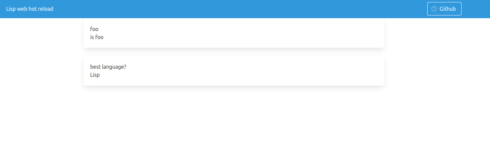

Well all know that we can start a web server in the REPL and develop a
web app as interactively as any other app, we know how to [connect to
a remote Lisp
image](https://lispcookbook.github.io/cl-cookbook/debugging.html#remote-debugging)
by starting a Swank server and how to interact with it from our
favorite editor on our machine, we know we can build a self-contained
binary of the web app and simply run it, but one thing I had not
realized, despite being the basics, is that by starting the web app
with `sbcl --load app.lisp`, we are dropped into the regular Lisp
REPL, with the web server running in its own thread (as in development
mode), and that we can consequently interact with the running app.

As a demonstration, you can clone this repository and run the example like this:

```
* rlwrap sbcl --load run.lisp

This is SBCL 1.4.5.debian, an implementation of ANSI Common Lisp.
re information about SBCL is available at <http://www.sbcl.org/>.
[…]
; Loading "web-live-reload"
..................................................
Starting the web server on port 7890
Ready. You can access the application!
*
```

it will load `project.asd`, install 3 Quicklisp dependencies (you must
have Quicklisp installed), start Hunchentoot on port 7890, and drop us
into a REPL.

You'll get this:



You can change the `*config*` variable:

~~~lisp
* (in-package :web-live-reload)
* (setf *config*
    '((:key "Name"
       :val "James")
      (:key "phone"
       :val "0098 007")
      (:key "secret language?"
       :val "Lisp")))
  ~~~

refresh, and voilà, your new config is live.

I was looking for a way to reload a user's config and personal data
from a running website, and I think this will be the solution. No
downtime. I'll be more careful on using this to recompile the whole
app, but we know it's possible.

That's all, but that made my day.
